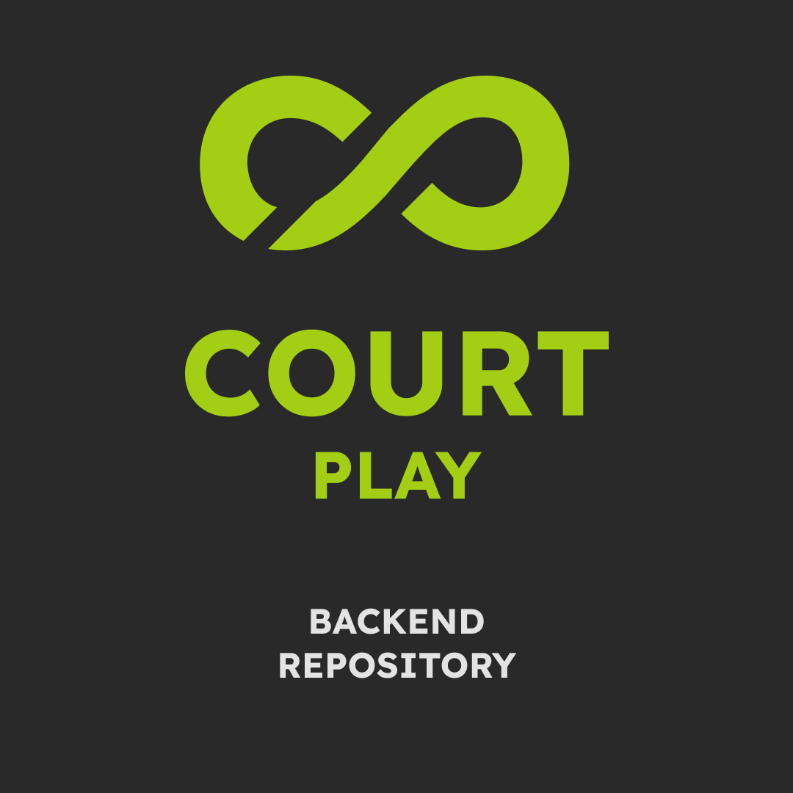

# 🎾 CourtPlay - AI Tennis Analytics Backend 🚀

<div align="center">
  
</div>

## 👋 Project Apa Sih Ini?

Halo guys! Selamat datang di **CourtPlay Backend**! 🎉

Jadi gini, project ini tuh adalah "otak" dari sistem CourtPlay. Kita bikin sistem yang bisa nonton video tenis kamu, terus secara *magic* (baca: Artificial Intelligence 🤖) dia bakal nganalisis pergerakan bola, pemain, dan lapangan. Hasilnya? Kamu bakal dapet insight sekelas pro player! Mulai dari heatmap pergerakan, hitungan pukulan, sampai replay video dengan overlay keren.

Intinya, upload video main tenis kamu, tinggal duduk manis, dan biarkan AI kita yang kerja keras buat ngasih data statistik yang *mind-blowing*! 🤯✨

---

## 🔗 Repository Terkait

Project ini gak berdiri sendiri loh! Ada temen-temennya yang lain:

*   🌐 **Website (Frontend & User Interface):** [CourtPlay Web](https://github.com/AbiyaMakruf/TelU-Tubes-BisnisDigital-CourtPlay-Web)
    *   *Tampilan antarmuka yang kece buat user upload video dan liat hasil analisis.*
*   🧠 **AI Development (Riset & Model Training):** [CourtPlay AI Development](https://github.com/AbiyaMakruf/TelU-Tubes-BisnisDigital-CourtPlay-AIDevelopment)
    *   *Dapur eksperimen tempat kita ngelatih model AI biar makin pinter.*

---

## 🛠️ Tech Stack yang Kita Pake

Kita pake teknologi-teknologi kece buat bikin ini semua jalan mulus. Nih intip dapur pacu kita:


*   **Bahasa Pemrograman:** Python 🐍 (Si raja data science!)
*   **AI & Computer Vision:**
    *   **YOLOv8:** Buat deteksi pemain & lapangan (Sat set wat wet! ⚡)
    *   **TrackNet:** Spesialis ngelacak bola tenis yang ngebut 🎾
    *   **PyTorch:** Framework deep learning andalan
    *   **OpenCV:** Buat ngolah gambar & video
*   **Backend Framework:** FastAPI (Cepet banget, sesuai namanya 🚀)
*   **Database & Storage:**
    *   **Supabase (PostgreSQL):** Nyimpen data user & statistik
    *   **Google Cloud Storage (GCS):** Gudang video & model AI
*   **Infrastructure:**
    *   **Docker:** Biar jalan di mana aja aman 🐳
    *   **Google Cloud Run:** Serverless deployment
    *   **Google Pub/Sub:** Antrian tugas biar gak macet
*   **Monitoring:** Prometheus & Grafana (Biar kita tau kalo ada yang sakit 🤒)
*   **Notifikasi:** Mailtrap (Kirim email laporan analisis 📧)

---

## ✨ Fitur Backend Kece

Apa aja sih yang bisa dilakuin sama backend ini? Banyak!

1.  **Automated Video Analysis:** Upload video, sistem langsung kerja otomatis. Gak perlu klik-klik ribet.
2.  **Object Tracking:** Kita lacak bola 🎾 dan pemain 🏃‍♂️ frame demi frame.
3.  **Court Mapping (Homography):** Mengubah pandangan kamera jadi pandangan atas (2D) biar analisisnya akurat.
4.  **Stroke Recognition:** Tau kamu lagi Forehand, Backhand, atau Serve.
5.  **Visual Analytics:**
    *   🔥 **Heatmaps:** Liat area mana yang paling sering kamu injak atau tempat bola jatuh.
    *   🗺️ **Minimaps:** Replay pertandingan versi 2D.
6.  **Reporting:** Kirim hasil analisis lengkap langsung ke email kamu.

---

## ⚙️ Persiapan (Prerequisites)

Sebelum mulai, pastiin kamu udah siapin "bumbu-bumbu" ini ya:

*   **Google Cloud Platform (GCP) Account:**
    *   Aktifin **Cloud Run** buat deploy.
    *   Aktifin **Artifact Registry** buat nyimpen Docker image.
    *   Bikin bucket di **Cloud Storage (GCS)**.
    *   Setup **Pub/Sub** buat antrian messaging.
*   **Supabase Account:** Buat database PostgreSQL-nya.
*   **Gemini API Key:** (Opsional, kalo pake fitur generative AI tambahan).
*   **Mailtrap Account:** Buat testing kirim email.
*   **Python 3.10+** & **Docker** di laptop kamu.

---

## 🚀 Cara Jalanin (How to Run)

### 🏠 Di Local (Laptop Sendiri)

1.  **Clone Repo ini:**
    ```bash
    git clone https://github.com/AbiyaMakruf/TelU-Tubes-BisnisDigital-CourtPlay-Backend.git
    cd TelU-Tubes-BisnisDigital-CourtPlay-Backend
    ```

2.  **Setup Environment Variables:**
    Buat file `.env` dan isi dengan credential GCP, Supabase, dll (liat contoh di `.env.example` kalo ada, atau tanya admin ya 😉).

3.  **Jalanin pake Docker (Paling Gampang):**
    ```bash
    docker build -t courtplay-backend .
    docker run -p 8080:8080 --env-file .env courtplay-backend
    ```

4.  **Atau jalanin Manual (Python):**
    ```bash
    pip install -r requirements.txt
    uvicorn app.main:app --reload
    ```

### ☁️ Di Cloud (Deployment)

Kita udah setup **CI/CD** pake GitHub Actions, jadi setiap ada update di branch `main`, dia bakal otomatis:
1.  Build Docker Image.
2.  Push ke Google Artifact Registry.
3.  Deploy revisi baru ke Cloud Run.

Canggih kan? 😎 Jadi gak perlu deploy manual capek-capek.

---

## 📸 Galeri Screenshot

Biar gak penasaran, nih liat penampakan aplikasinya. UI-nya pake gaya **Glassmorphism** + **Neon Green** yang futuristik abis! 🟢⚫

### 🌐 Landing Page & Public
| Landing Page 1 | Landing Page 2 |
| :---: | :---: |
|  |  |

| Landing Page 3 | Landing Page 4 | Landing Page 5 |
| :---: | :---: | :---: |
|  |  |  |

| About Us | Pricing | News |
| :---: | :---: | :---: |
|  |  |  |

### 🔐 Authentication
| Login | Register |
| :---: | :---: |
|  |  |

### 👤 User Dashboard & Features
| Homepage | Upload Video |
| :---: | :---: |
|  |  |

| Analytics Detail | Profile | Social |
| :---: | :---: | :---: |
|  |  |  |

| Matchmaking | Friend Profile |
| :---: | :---: |
|  |  |

### 👮 Admin Dashboard
| Dashboard | User Management | Project Management |
| :---: | :---: | :---: |
|  |  |  |

---

## 🧠 Output Analytics AI

Ini nih hasil kerja keras si AI! Dia bisa ngasih visualisasi keren kayak gini:

### 📹 Video Analysis Results
*(Klik link atau download file di folder `README/output_analytics/` buat liat videonya)*

*   **Output Full Analysis:** `output.mp4`
*   **Heatmap Player:** `heatmap_player.mp4`
*   **Minimap Player:** `minimap_player.mp4`
*   **Minimap Ball:** `minimap_ball.mp4`
*   **Player Keypoints:** `playerKeyPoint.mp4`

### 🖼️ Visual Output
| Heatmap Player | Minimap Ball |
| :---: | :---: |
|  |  |

---

## 🖼️ Poster Project


---

Made with ❤️ and ☕ by **CourtPlay Team**.
Enjoy the game! 🎾